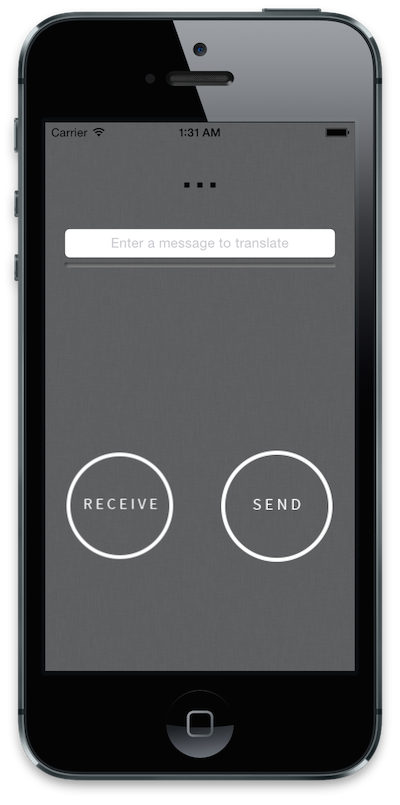

##Morse Torch

=====

#### This app allows user to enter a message and then translate that message via Morse Code through the iPhone's rear LED.

- Receive Mode is currently detecting and displaying luminosity readings but is not yet translating incomming messages back into text. 